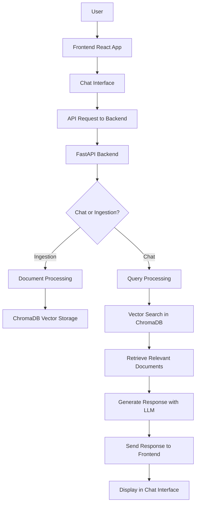

# RAG Chatbot

A Retrieval-Augmented Generation (RAG) chatbot that allows users to interact with documents through natural language queries. The system ingests documents, stores them in a vector database, and retrieves relevant information to generate context-aware responses.

## Features

- **Document Ingestion**: Upload and process various document formats
- **Vector Storage**: Uses ChromaDB for efficient vector storage and retrieval
- **Chat Interface**: Web-based chat interface built with React
- **API Backend**: FastAPI-based backend for handling chat and ingestion requests
- **Real-time Responses**: Generate responses based on retrieved document context

## Architecture



## Tech Stack

### Backend
- Python
- FastAPI
- ChromaDB
- Other dependencies (see requirements.txt)

### Frontend
- React
- JavaScript
- Lucide React (for icons)

## Installation

### Prerequisites
- Python 3.8+
- Node.js 14+
- Git

### Backend Setup
1. Navigate to the backend directory:
   ```bash
   cd backend
   ```

2. Install Python dependencies:
   ```bash
   pip install -r requirements.txt
   ```

3. Run the backend server:
   ```bash
   uvicorn main:app --reload
   ```

### Frontend Setup
1. Navigate to the frontend directory:
   ```bash
   cd frontend
   ```

2. Install Node.js dependencies:
   ```bash
   npm install
   ```

3. Start the development server:
   ```bash
   npm start
   ```

## Usage

1. Start both backend and frontend servers as described above.
2. Open your browser and navigate to the frontend URL (usually http://localhost:3000).
3. Upload documents through the ingestion interface.
4. Start chatting with your documents using the chat interface.

## API Endpoints

- `POST /ingest`: Upload and process documents
- `POST /chat`: Send chat messages and receive responses

## Project Structure

```
├── backend/
│   ├── main.py              # FastAPI application
│   ├── requirements.txt     # Python dependencies
│   ├── chroma_db/           # Vector database storage
│   └── routes/
│       ├── chat.py          # Chat API endpoints
│       └── ingestion.py     # Document ingestion endpoints
├── frontend/
│   ├── public/              # Static assets
│   ├── src/
│   │   ├── App.js           # Main React app
│   │   ├── ChatInterface.jsx # Chat component
│   │   ├── LandingPage.jsx  # Landing page component
│   │   └── ...              # Other React components
│   ├── package.json         # Node.js dependencies
│   └── README.md            # Frontend README
└── README.md                # This file
```

## Contributing

1. Fork the repository
2. Create a feature branch
3. Make your changes
4. Submit a pull request

## License

This project is licensed under the MIT License.